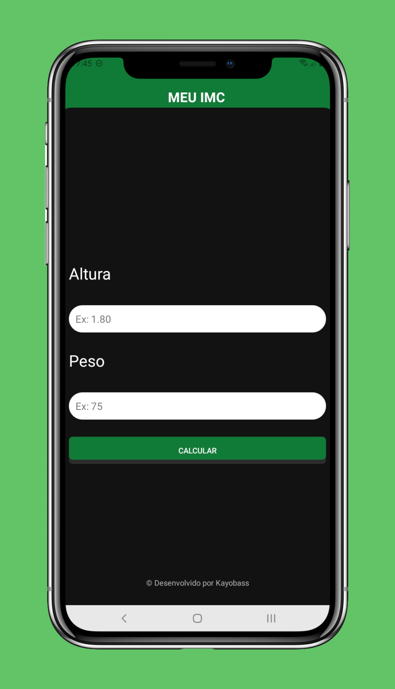

O Meu Imc é uma aplicação de cálculo do Índice de Massa Corporal (IMC) construída em Kotlin, projetada para ajudar os usuários a acompanhar sua saúde e bem-estar. Este projeto é um aplicativo simples, mas funcional, que permite aos usuários calcular seu IMC com base em seu peso e altura.
Design inspirado no projeto do curso de React Native do OneBitCode.

## Principais Recursos

- **Cálculo do IMC:** Os usuários podem inserir seu peso e altura, e o aplicativo calculará automaticamente seu IMC com base nesses valores.

- **Feedback Visual:** Com base no IMC calculado, o aplicativo fornece feedback visual, incluindo uma mensagem indicando se o usuário está abaixo do peso, com peso normal, com sobrepeso ou obeso.

- **Validação de Entrada:** O aplicativo inclui validação de entrada para garantir que os usuários insiram dados válidos.

## Capturas de Tela

|              Interface Principal               |             Ícone do Projeto             |
|:----------------------------------------------:|:----------------------------------------:|
|  |  |

## Tecnologias Usadas

- **Android SDK:** A base do aplicativo, permitindo a criação de interfaces móveis multiplataforma.
- **Kotlin:** Lógica de programação